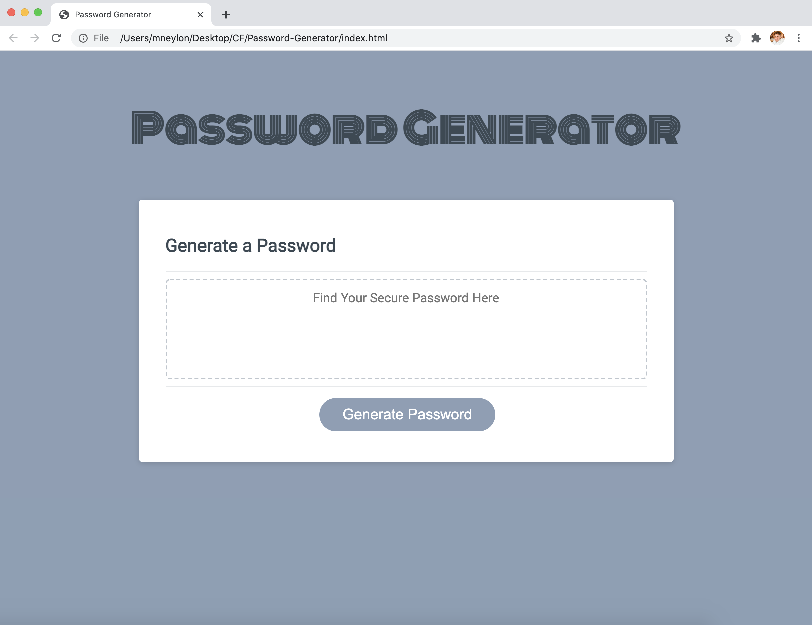
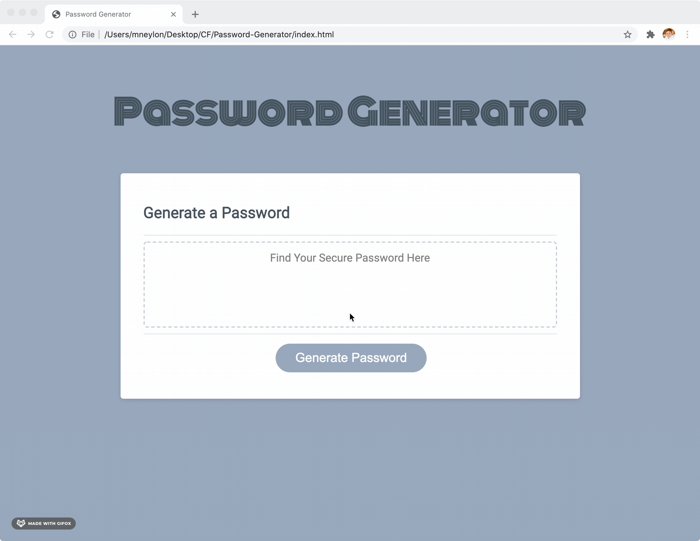

Password Generator that generates a random password based on user-selected criteria.

[Check out the repo here](https://neylonmc.github.io/Password-Generator/)

## Table of Contents

- [User Story](#user-story)
- [Installation](#installation)

- [Links and Screenshots](#links-and-screenshots)

- [Created By](#created-by)

- [License](#license)

## User Story

We use passwords every day. Password secruity is important. Instead of using your name or dogs name for your password, this application will allow users to make a unique password to keep their accounts secure.

```
AS an individual, I want to protect my accounts from hackers.
I WANT to be able to have a unique password of random letters, numbers and special characters.
SO I can have faith my accounts are secure and safe.
```

## Links and Screenshots

Repo: https://neylonmc.github.io/Password-Generator/

User Interface:


Creating Password:


## Created by

- [Meaghan Neylon](https://github.com/neylonmc "Visit Meaghan's GitHub")

## License

[](https://opensource.org/licenses/MIT)
